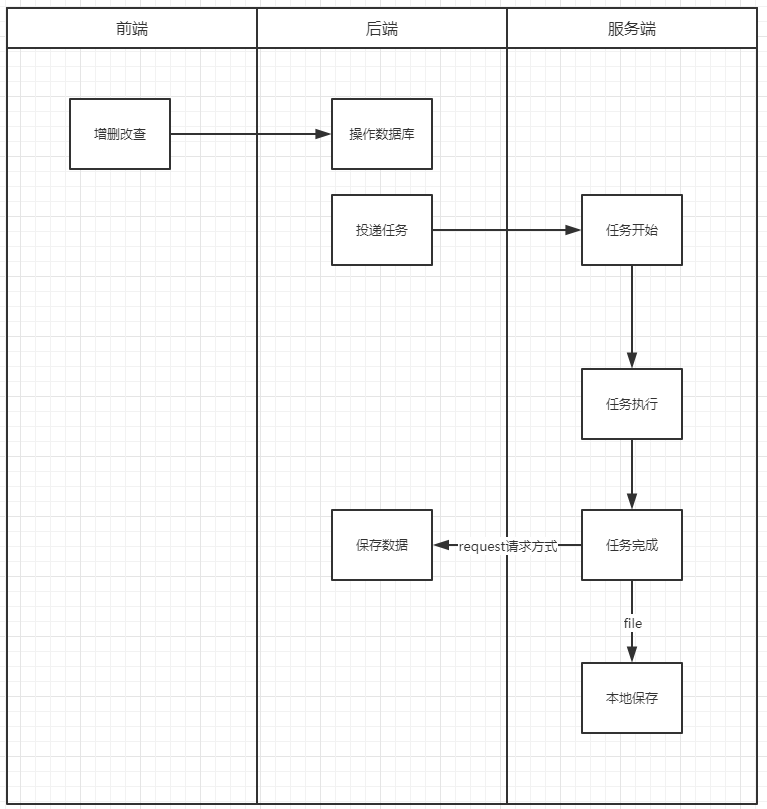
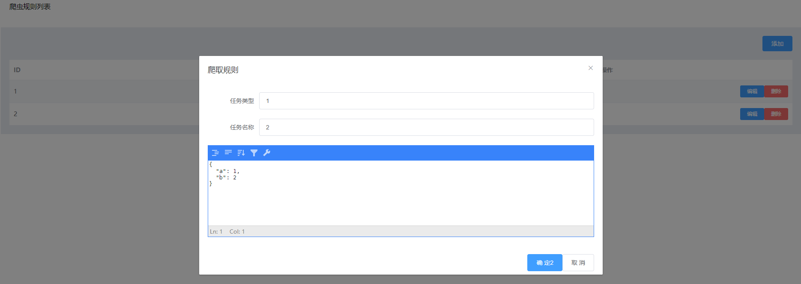
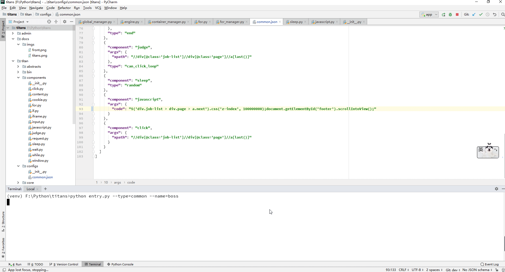

# titans
Selenium automation framework - Selenium自动化框架



### 前端

采用Element-UI进行前端布局设计，前后分离的模式

更新新版 `vue` 2.6.11 版本，之前旧版要使用 `build` 目录，导致旧版有问题



#### 生成生产环境
```markdown
npm run build
```

#### `nginx` 配置
```markdown
server {
        listen       80;
        server_name  www.titans.com ;
        root   "F:/Python/titans/admin/frontend/dist";
        location /$ {
            index  index.html index.htm;
            try_files $uri $uri/;
        }
}
```

配置好后，就能够使用前端页面了

> 注意这里面要将frontend->config->index.js->build下的assetsPublicPath: '/' 改为assetsPublicPath: './' 才能找到静态文件
的路径

### 后端

`flask` 框架进行编写，数据表结构如下
```mysql
CREATE TABLE `configs` (
  `id` int(10) unsigned NOT NULL AUTO_INCREMENT,
  `type` varchar(32) NOT NULL COMMENT '任务类型',
  `name` varchar(32) DEFAULT NULL COMMENT '任务名称',
  `json_text` json DEFAULT NULL COMMENT '任务命令集',
  PRIMARY KEY (`id`),
  UNIQUE KEY `type` (`type`,`name`)
) ENGINE=InnoDB AUTO_INCREMENT=5 DEFAULT CHARSET=utf8;


CREATE TABLE `tasks` (
  `id` int(11) NOT NULL,
  `uuid` varchar(36) NOT NULL COMMENT '分布式唯一id',
  `result` json DEFAULT NULL COMMENT '结果集',
  `type` varchar(32) DEFAULT NULL COMMENT '任务类型',
  `name` varchar(32) DEFAULT NULL COMMENT '任务名',
  PRIMARY KEY (`id`)
) ENGINE=InnoDB DEFAULT CHARSET=utf8;
```

#### `nginx` 反向代理配置

```markdown
server {
        listen       80;
        server_name  www.titans.com ;
        root   "F:/Python/titans/admin/frontend/dist";
        location /$ {
			index  index.html index.htm;
            try_files $uri $uri/;
        }
		location /api/configs/ {
			proxy_set_header Host $host;
			proxy_set_header X-Forwarded-For $remote_addr; 
            proxy_pass   http://127.0.0.1:5000/configs/;
        }
}
```

#### 执行命令

进入到 `titans` -> `admin` 目录下，执行以下命令启动 `web` 服务
```shell
python app.py
```

### 服务端

`Selenium` 自动化框架，采用 `json` 配置化的形式进行数据采集或自动化测试等

#### 架构


目录结构

```markdown
+---abstracts // 抽象类
+---bin // 二进制文件
+---components // 组件
+---configs // 配置文件
+---core // 核心逻辑
+---hooks // 钩子
+---logs // 日志
+---manages // 全局管理类
+---storages // 存储保存位置
|   \---cookies
+---utils // 通用工具

```

组件
```markdown
│  click.py                 点击操作类                    
│  content.py               html标签内容获取类                    
│  cookie.py                cookie操作类                        
│  for.py                   for循环流程类                    
│  if.py                    if流程类                    
│  iframe.py                iframe操作类            
│  input.py                 输入操作类                    
│  javascript.py            javascript代码执行类                  
│  judge.py                 条件判断类                      
│  request.py               请求类                          
│  sleep.py                 睡眠延时类                        
│  wait.py                  等待事件类                       
│  while.py                 while循环类        
│  window.py                window标签页切换类                         
```


### chromedirver下载（对应相应的版本）

https://npm.taobao.org/mirrors/chromedriver


### 配置使用

配置中使用`{}`作为一个组件的调用，`[]`作为一个作用域来使用。
`{}`有三个基本参数：
1. `args`配置参数

2. `type`组件使用具体方法

3. `component`所使用的组件名称

`[]`主要是作用域，用于`if`, `for`, `while`循环这些有自己作用域的组件，然后在里面调用`{}`就可以
实现流程控制了

boss直聘数据拉取栗子：



```json
[
  {
    "component": "request",
    "args": {
      "url": "https://www.zhipin.com/c101280100/?query=PHP&page=9"
    },
    "type": "browser"
  },
  [
    {
      "component": "for",
      "args": {
        "xpath": "//div[@class='job-list']//ul//li",
        "turn_on": false
      },
      "type": "start"
    },
    {
      "component": "for",
      "args": {
        "xpath": "./div[@class='job-primary']//div[@class='info-primary']//div[@class='job-title']",
        "is_text": true,
        "key": "language"
      },
      "type": "grab"
    },
    {
      "component": "for",
      "args": {
        "xpath": "./div[@class='job-primary']//div[@class='info-primary']//span[@class='red']",
        "is_text": true,
        "key": "salary_range"
      },
      "type": "grab"
    },
    {
      "component": "for",
      "args": {
        "xpath": "./div[@class='job-primary']//div[@class='info-primary']/h3/following-sibling::p",
        "is_text": true,
        "key": "address_workAge_education"
      },
      "type": "grab"
    },
    {
      "component": "for",
      "args": {
        "xpath": "./div[@class='job-primary']//div[@class='info-company']//a",
        "is_text": true,
        "key": "company"
      },
      "type": "grab"
    },
    {
      "component": "for",
      "args": {
        "xpath": "./div[@class='job-primary']//div[@class='info-company']//p",
        "is_text": true,
        "key": "tmt"
      },
      "type": "grab"
    },
    {
      "component": "for",
      "args": {
        "xpath": "./div[@class='job-primary']//div[@class='info-publis']/h3",
        "is_text": true,
        "key": "hr_name_position"
      },
      "type": "grab"
    },
    {
      "component": "for",
      "args": {
        "key": "job_list_custom_array"
      },
      "type": "end"
    },
    {
      "component": "judge",
      "args": {
        "xpath": "//div[@class='job-list']//div[@class='page']//a[last()]",
        "class": "disabled"
      },
      "type": "has_class_terminate"
    },
    {
      "component": "sleep",
      "type": "random"
    },
    {
      "component": "javascript",
      "args": {
        "code": "$('div.job-list > div.page > a.next').css('z-index', 100000000);document.getElementById('footer').scrollIntoView();"
      }
    },
    {
      "component": "click",
      "args": {
        "xpath": "//div[@class='job-list']//div[@class='page']//a[last()]"
      }
    }
  ]
]
```


### 优势

采用json配置化的方式进行浏览器自动化，现在已有10+组件强力驱动，可以应对绝大多数的自动化操作。这个
框架最大特点就是编写json就可以实现像写代码一样进行流程控制，为采集网站结构变动提供无需重启服务的
便利


### QQ交流群

`742398812`


本项目仅供学习用途

### Star History

[](https://star-history.com/#dmf-code/titans&Date)
